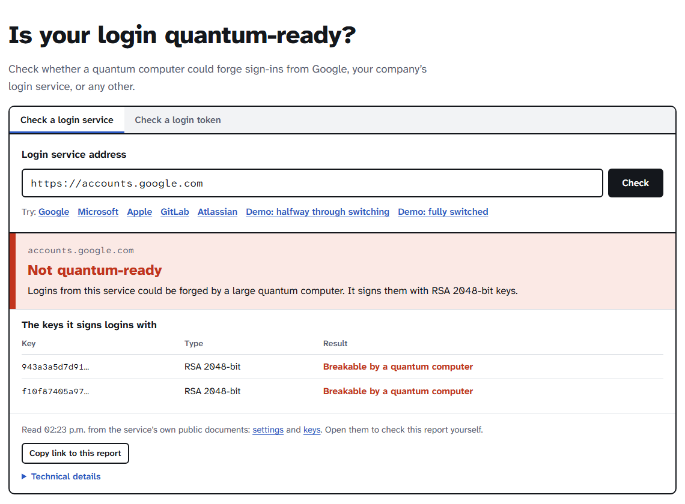
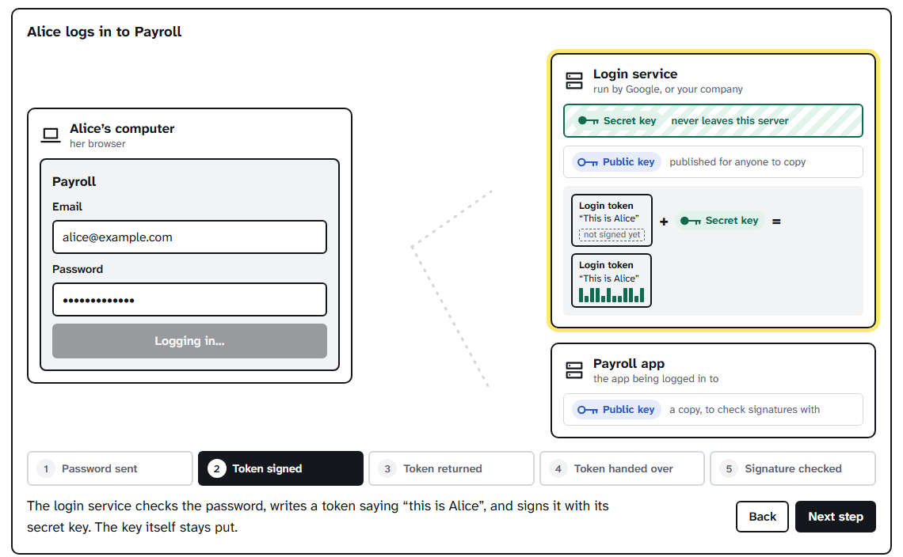
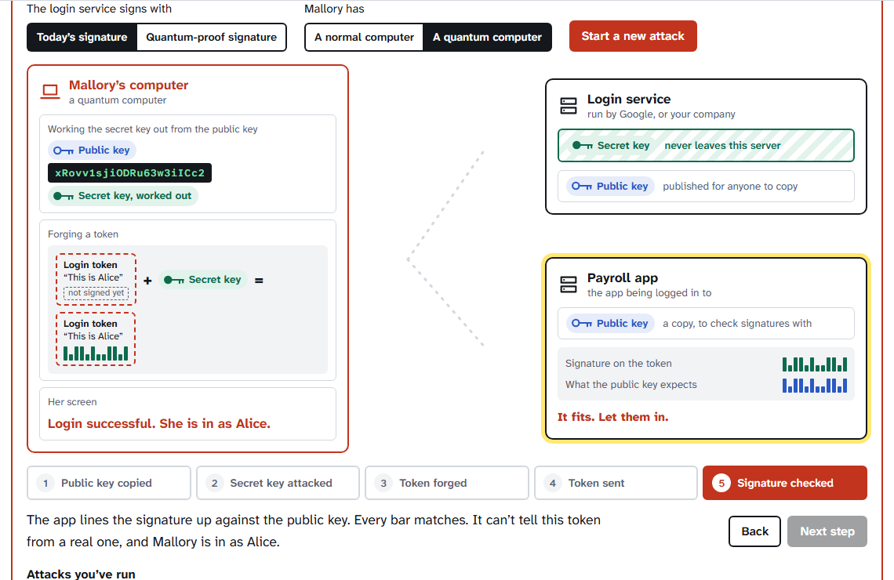
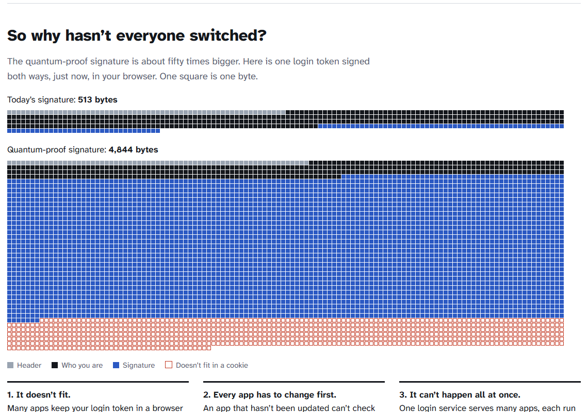
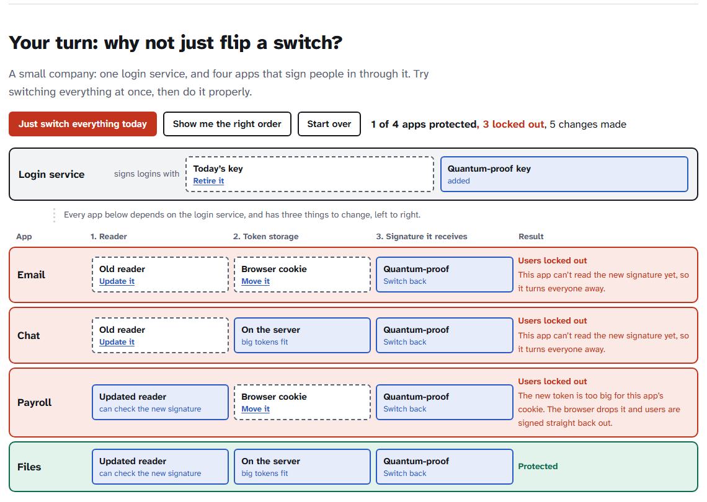
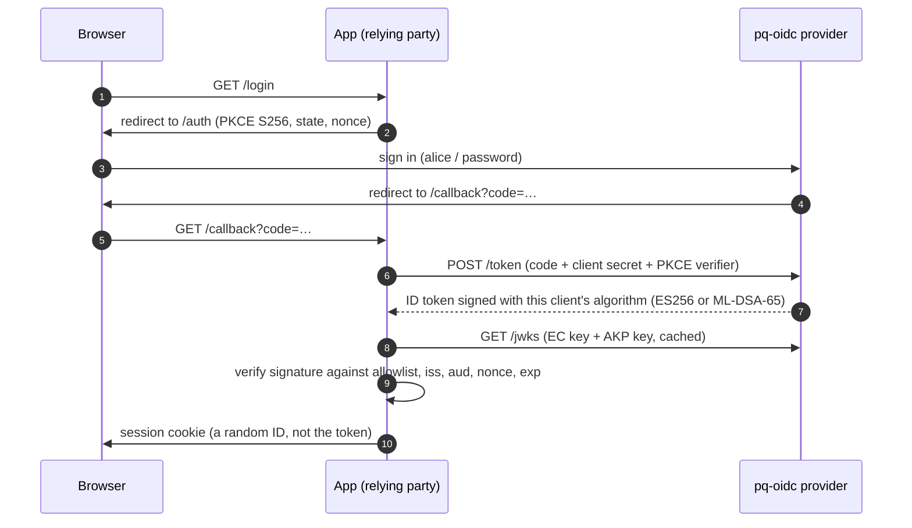

# pq-oidc: is your login quantum-ready?

[](https://github.com/probablyliam/pq-oidc/actions/workflows/ci.yml)
[](https://github.com/probablyliam/pq-oidc/actions/workflows/codeql.yml)
[](LICENSE)

A free tool that checks whether a quantum computer could forge sign-ins from any login service (Google, Okta, Entra ID, Keycloak…), and a working login service that makes the fix by moving apps to quantum-proof signatures one at a time.

### ▶ [Run a check: probablyliam.github.io/pq-oidc](https://probablyliam.github.io/pq-oidc/)

<p align="center"></p>

## What it checks, and what it doesn't

When you sign in with Google or a work account, a login service gives the app a short signed message, a **token**, saying who you are. The app trusts it because of the **signature**. Today's signatures (RSA, elliptic curves) can be broken by a large enough quantum computer, which could then sign in as anyone.

This tool reads the keys a login service publishes and tells you whether its signatures are the breakable kind.

It checks the login signature only. It doesn't test the encrypted connection to a site, and it doesn't test your apps, only the login service they rely on.

## The page, top to bottom

<table>
<tr>
<td width="50%"></td>
<td width="50%"></td>
</tr>
<tr>
<td><b>What the result means.</b> Log in, then step through what happens between the three machines: what travels, what gets signed, and what never leaves the login service.</td>
<td><b>The attack.</b> Choose the signature and the attacker's computer, then step through her attempt, including the secret key being worked out and the app's check lining the signature up.</td>
</tr>
<tr>
<td width="50%"></td>
<td width="50%"></td>
</tr>
<tr>
<td><b>Why hasn’t everyone switched?</b> The quantum-proof signature is about fifty times bigger, and every app has to change first.</td>
<td><b>Why not just flip a switch?</b> Try it on a small company and three of four apps lock people out. Then do it in the right order.</td>
</tr>
</table>

## Check your own login service

The check reads the public keys a login service publishes (every OpenID Connect provider publishes them) and reports whether they could be broken by a quantum computer.

- **In the browser:** type the address into the [check](https://probablyliam.github.io/pq-oidc/), for example `https://your-tenant.auth0.com`. Your browser fetches the keys directly; nothing passes through this project. Two demo services show what "partly" and "fully" switched look like.
- **From a terminal** (for services that block browsers, such as Okta and Slack, and for ones only reachable inside your network):

```bash
npm run check -- https://your-company.okta.com
```

On 2026-10-02 it reported **not ready** for all 20 public login services I tried, including Google, Microsoft, Apple, Okta, Auth0, Salesforce, Atlassian, Slack, PayPal, GitLab and Red Hat’s Keycloak.

**What it can and can’t tell you.** It reads what the service publishes: the algorithms it offers and the keys it signs with. It can’t see services that don’t speak OpenID Connect, and it doesn’t test your apps, only the login service they rely on.

## How do you know it works?

```bash
npm run prove
```

That one command starts the real login service, performs real sign-ins, and checks every claim with code that shares nothing with the code under test:

```
1. Real sign-ins against the provider
   legacy-app received a 498-byte ID token, pq-app a 4824-byte ID token
2. The provider's published keys, read with plain fetch (no project code)
   EC/ES256, AKP/ML-DSA-65
3. Independent verification in Python
   ✓ Python accepts the ES256 token
   ✓ Python accepts the ML-DSA-65 token (3,309-byte signature per FIPS 204)
4. A legacy configuration refuses the post-quantum token
   ✓ REJECTED alg-not-allowed
   ✓ REJECTED bad-signature (corrupted token)
5. Readiness verdicts next to the raw key types
   ✓ this provider (EC + AKP keys): partial
   ✓ Google (RSA/RS256, RSA/RS256): not-ready
All claims held.
```

Beyond that:

- **Two independent verifiers.** The TypeScript verifier and a separate [Python verifier](interop/python) (built on `pyca/cryptography`) must agree on every honest token and reject six kinds of forgery with identical codes (`npm run interop`).
- **A real browser.** Chrome silently dropped the 4,895-byte cookie holding the new token; the end-to-end tests reproduce that behaviour.
- **A real cluster.** CI deploys the service to Kubernetes, signs in through both apps, then switches an unprepared app too early and expects its sign-in to fail.
- **70 automated tests**, including the classic token attacks and protocol abuse (see [Security](#security)).

## Has this been done before?

Partly, and it’s worth being exact about it.

- **The size problem is known.** The [OpenID Foundation described it](https://openid.net/post-quantum-openid-connect/) in September 2026, as did others. This project measures it; it didn’t discover it.
- **Post-quantum token libraries exist** in several languages, and some identity servers have started adding ML-DSA.
- **What I couldn’t find elsewhere:** a tool that checks whether an arbitrary login service is quantum-ready, an exact byte-for-byte projection for your own tokens, and a runnable login service that demonstrates the per-app switch along with its failure modes.

## Run the login service

Needs Node.js 24.7 or newer (for native ML-DSA). Dependencies install into the project folder only.

```bash
git clone https://github.com/probablyliam/pq-oidc.git
cd pq-oidc
npm install
npm start
```

| | Address | Signature it receives |
|---|---|---|
| Legacy App | http://localhost:3001 | old (ES256) |
| PQ-Ready App | http://localhost:3002 | new (ML-DSA-65) |
| Login service | http://localhost:3000 | |

Sign in as `alice` or `bob`, password `quantum-safe` (fictional demo users).

<p align="center"></p>

```bash
# Switch Legacy App to the new signature before it's ready, and watch sign-in fail with a clear reason
LEGACY_ID_TOKEN_ALG=ML-DSA-65 npm start

# What happens to one of your own tokens
npm run check -- eyJhbGciOi...
```

**Docker:** `docker compose up --build`. **Kubernetes:** a Helm chart is in [`deploy/helm/pq-oidc`](deploy/helm/pq-oidc).

---

# For engineers

## Measurements

Measured on the running system. Method and details: [docs/findings.md](docs/findings.md).

| | ES256 | ML-DSA-65 | |
|---|---:|---:|---|
| Signature | 64 B | 3,309 B | fixed by FIPS 204 |
| ID token for a typical user | 553 B | 4,879 B | 8.8× |
| Public key in the JWKS | 204 B | 2,707 B | 13× |
| Sign / verify (Node.js, native) | 0.08 / 0.10 ms | 0.55 / 0.14 ms | speed isn’t the problem |

## Architecture



- **Provider** ([`packages/provider`](packages/provider)): [`oidc-provider`](https://github.com/panva/node-oidc-provider) (OpenID Certified), configured as an OAuth 2.1-style server: authorization code flow only, PKCE S256 required, exact redirect URIs, single-use codes. It publishes an ES256 key and an ML-DSA-65 key (RFC 9964 `"kty": "AKP"`). Each client's `id_token_signed_response_alg` decides which one signs its tokens; that setting is the migration switch.
- **Apps** ([`packages/rp`](packages/rp)): `openid-client` runs the protocol. The ID token signature is then verified explicitly with an algorithm allowlist, which is what makes an unprepared app refuse ML-DSA and what stops `alg: none` and algorithm confusion.
- **Shared toolkit** ([`packages/token-kit`](packages/token-kit)): measurement, exact size projection, verification, and the readiness analysis used by the CLI and the site.
- **Python verifier** ([`interop/python`](interop/python)): about 150 lines, because no Python JWT library supports RFC 9964 yet.
- **Site** ([`apps/lab`](apps/lab)): static React. ML-DSA runs in the browser through `@noble/post-quantum`; tests prove its tokens interoperate with Node's native ML-DSA both ways.

No build step for the server code: Node.js 24 runs the TypeScript sources directly.

## Security

The [threat model](docs/threat-model.md) covers the provider, apps and tokens with STRIDE, linking each mitigation to the test that proves it. Tests include:

- **Token forgery:** `alg: none`, algorithm confusion (HS256 signed with the public key), attacker keys embedded in the header, edited claims, expired tokens, wrong audience, nonce replay.
- **Protocol abuse:** missing PKCE, `plain` PKCE, implicit flow, unregistered redirect URIs, unknown clients, authorization code replay, stolen codes without the verifier, one app redeeming another's code, wrong client secret.
- **Web:** CSP without `unsafe-inline`, `frame-ancestors 'none'`, HTML escaping, login CSRF across browser sessions, no private key material in the JWKS.
- **Containers:** non-root, read-only filesystem, all capabilities dropped, seccomp `RuntimeDefault`.

CI also runs CodeQL, `npm audit`, and Dependabot.

**Not production-ready by design:** state and keys live in memory (one replica), there's no rate limiting on the login form, and demo users have a published password. See [residual risks](docs/threat-model.md#residual-risks-and-deliberate-non-goals).

## Design decisions

1. [Build on node-oidc-provider instead of writing an OIDC server](docs/decisions/0001-use-node-oidc-provider.md)
2. [Use ML-DSA-65 (and why not SLH-DSA, FN-DSA or composite signatures yet)](docs/decisions/0002-ml-dsa-65.md)
3. [Migrate one app at a time with per-client signing algorithms](docs/decisions/0003-per-client-algorithm.md)
4. [Keep tokens server-side; cookies hold only a session ID](docs/decisions/0004-server-side-sessions.md)

## Development

```bash
npm test            # 70 tests
npm run lint && npm run typecheck
npm run prove       # the evidence above (needs the Python venv)
npm run interop     # Python <-> Node, both directions
npm run lab:dev     # the site, locally

# one-time Python setup (3.10+), inside the project folder
python -m venv interop/python/.venv
interop/python/.venv/bin/pip install -r interop/python/requirements.txt   # Windows: .venv\Scripts\pip
```

## Standards

[RFC 9964: ML-DSA for JOSE and COSE](https://www.rfc-editor.org/info/rfc9964/) · [FIPS 204: ML-DSA](https://csrc.nist.gov/pubs/fips/204/final) · [OpenID Connect Core 1.0](https://openid.net/specs/openid-connect-core-1_0.html) · [OAuth 2.1 (draft)](https://datatracker.ietf.org/doc/draft-ietf-oauth-v2-1/) · [RFC 7636: PKCE](https://www.rfc-editor.org/rfc/rfc7636) · [RFC 6265: Cookies](https://www.rfc-editor.org/rfc/rfc6265)

## License

[MIT](LICENSE)
