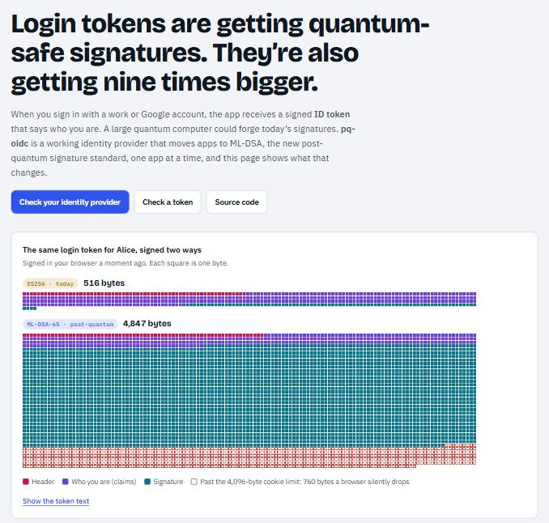
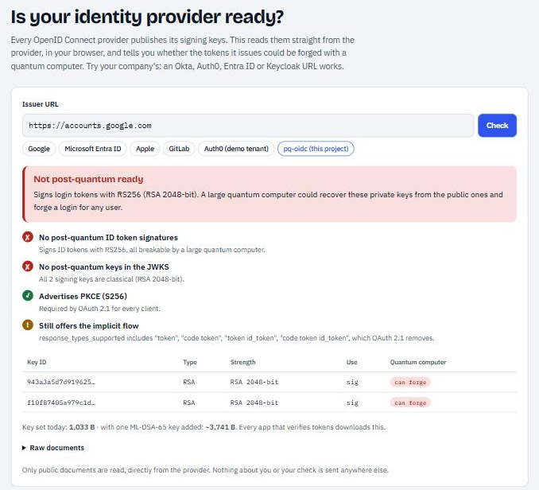
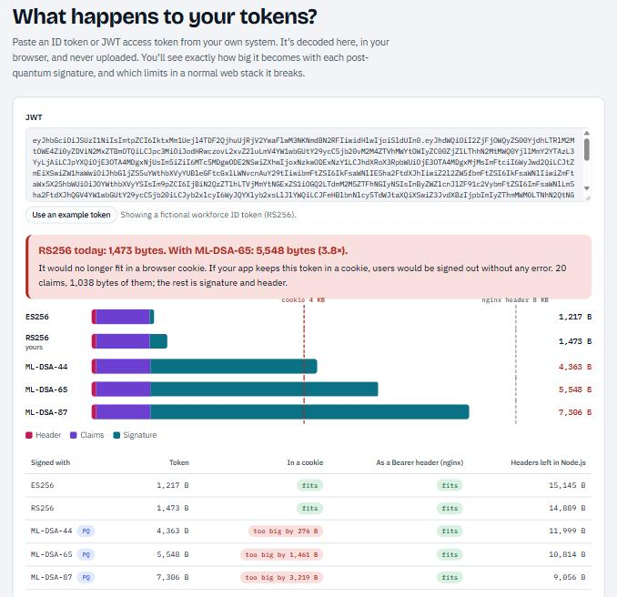
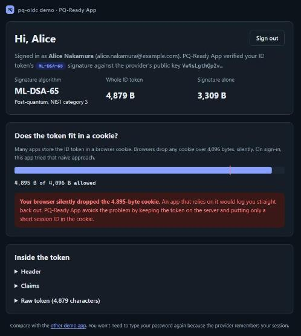
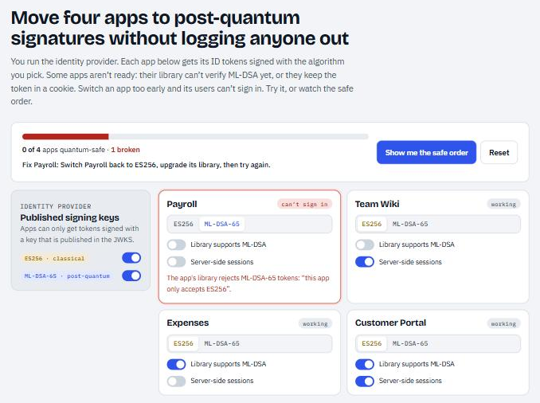
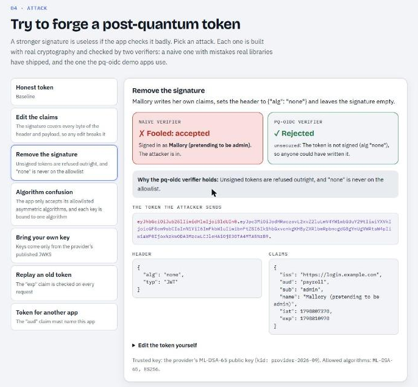
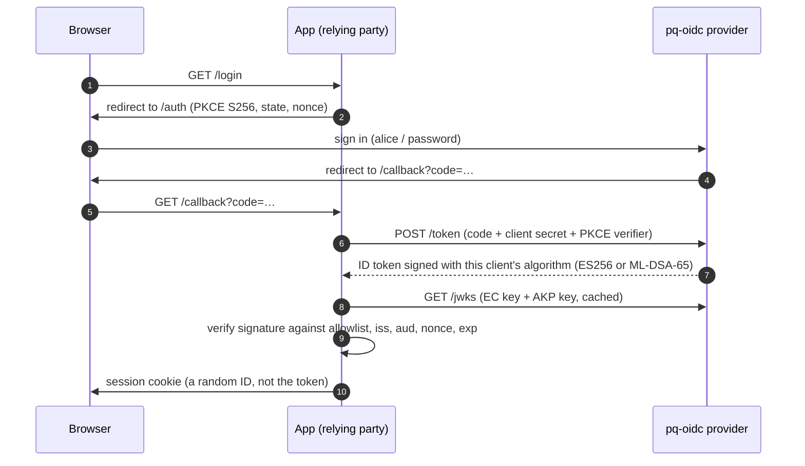

# pq-oidc

**A working OpenID Connect provider that moves login tokens to post-quantum signatures (ML-DSA, RFC 9964) one app at a time, plus browser and command-line tools that check whether *your* identity provider and tokens are ready.**

[](https://github.com/probablyliam/pq-oidc/actions/workflows/ci.yml)
[](https://github.com/probablyliam/pq-oidc/actions/workflows/codeql.yml)
[](https://probablyliam.github.io/pq-oidc/)
[](LICENSE)

### ▶ [Open the Token Lab](https://probablyliam.github.io/pq-oidc/): check a real provider or paste a token. Everything runs in your browser.

<p align="center"></p>

## In plain English

When you click "Sign in with Google" or sign in to a work app, a login service hands the app a signed **ID token** that says who you are. The app checks the signature before letting you in.

Today's signatures rely on math that a large quantum computer could solve, which would let an attacker forge a login for anyone. There is now a replacement: **ML-DSA**, standardised by NIST (FIPS 204) and approved for login tokens in May 2026 (RFC 9964).

Switching isn't just a setting. Apps that haven't upgraded reject the new tokens, and the new tokens are about **nine times bigger**, too big for the browser cookies many apps keep them in. This project is a login service that makes the switch safely, one app at a time, and a set of tools that shows you what the switch would do to *your* systems.

## What you can do with it

| | |
|---|---|
| **Check any identity provider** | Enter an issuer URL (Okta, Auth0, Entra ID, Keycloak, Google…). It reads the provider's public keys and reports whether its tokens could be forged with a quantum computer, plus OAuth 2.1 hygiene (PKCE, implicit flow, `alg: none`). [In the browser](https://probablyliam.github.io/pq-oidc/#provider) or `npm run check -- <issuer>`. |
| **Check your own tokens** | Paste a JWT. It calculates, byte for byte, how big it becomes with each ML-DSA parameter set and which real limits it breaks (browser cookies, nginx headers, Node.js headers), then re-signs it with ML-DSA-65 in your browser to prove the numbers. Nothing is uploaded. |
| **Run a post-quantum provider** | `npm start` runs the provider and two apps: one receives ES256 tokens, one receives ML-DSA-65 tokens. Sign in to both and compare. |
| **Rehearse the migration** | Flip one setting (`LEGACY_ID_TOKEN_ALG=ML-DSA-65`) to see what an unprepared app does, or use the simulator in the Token Lab. |

<table>
<tr>
<td width="50%"></td>
<td width="50%"></td>
</tr>
<tr>
<td><b>Provider check.</b> Live result for Google on 2026-09-30.</td>
<td><b>Token check.</b> An example workforce token, projected and re-signed.</td>
</tr>
</table>

## What I found

Measured on the running system. Details and methodology: [docs/findings.md](docs/findings.md).

| | ES256 (today) | ML-DSA-65 | |
|---|---:|---:|---|
| Signature | 64 B | 3,309 B | fixed by FIPS 204 |
| ID token for a typical user | 553 B | 4,879 B | **8.8× larger** |
| Public key in the JWKS | 204 B | 2,707 B | 13× larger |
| Sign / verify (Node.js, native) | 0.08 / 0.10 ms | 0.55 / 0.14 ms | speed isn't the problem |

1. **The token no longer fits in a cookie.** Browsers silently drop cookies over 4,096 bytes. The PQ-Ready App tries the naive approach on every sign-in and reports what your browser did; it drops the 4,895-byte cookie every time. The fix is server-side sessions ([ADR 4](docs/decisions/0004-server-side-sessions.md)).
2. **Big providers aren't ready.** Google, Microsoft Entra ID, Apple, GitLab, Auth0 and GitHub Actions all offered only classical algorithms on 2026-09-30. None published an ML-DSA key.
3. **Order matters.** Switch an app before its library supports ML-DSA and every sign-in fails. Per-client algorithms make the rollout, and the rollback, one setting per app ([ADR 3](docs/decisions/0003-per-client-algorithm.md)).

<p align="center"></p>

**Also in the Token Lab:** a migration simulator where switching an app too early breaks it (and "Show me the safe order" does it properly), and an attack playground where real forged tokens meet a naive verifier and the pq-oidc verifier side by side.

<table>
<tr>
<td width="50%"></td>
<td width="50%"></td>
</tr>
</table>

## Run it

Needs Node.js 24.7 or newer (for native ML-DSA). Dependencies install into the project folder only.

```bash
git clone https://github.com/probablyliam/pq-oidc.git
cd pq-oidc
npm install
npm start
```

| | URL | ID tokens |
|---|---|---|
| Legacy App | http://localhost:3001 | ES256 |
| PQ-Ready App | http://localhost:3002 | ML-DSA-65 |
| Provider | http://localhost:3000 | discovery, JWKS |

Sign in as `alice` or `bob`, password `quantum-safe` (fictional demo users).

```bash
# Move Legacy App to ML-DSA-65 before it's ready, and watch sign-in fail with a clear reason
LEGACY_ID_TOKEN_ALG=ML-DSA-65 npm start

# Check any provider or token from a terminal (no browser CORS limits)
npm run check -- https://token.actions.githubusercontent.com
npm run check -- eyJhbGciOi...

# The Token Lab, locally
npm run lab:dev
```

**Docker:** `docker compose up --build` runs the same three services as separate, read-only, non-root containers.

**Kubernetes:** a Helm chart lives in [`deploy/helm/pq-oidc`](deploy/helm/pq-oidc). CI installs it on a [kind](https://kind.sigs.k8s.io/) cluster, signs in through both apps, then migrates Legacy App too early with `helm upgrade` and checks that the sign-in is refused.

```bash
docker build -t pq-oidc:local .
kind load docker-image pq-oidc:local
helm install pq-oidc deploy/helm/pq-oidc
helm upgrade pq-oidc deploy/helm/pq-oidc --reuse-values --set apps.legacy.idTokenAlg=ML-DSA-65
```

## How it works



- **Provider** ([`packages/provider`](packages/provider)): [`oidc-provider`](https://github.com/panva/node-oidc-provider), which is OpenID Certified, configured as an OAuth 2.1-style server: authorization code flow only, PKCE S256 required, exact redirect URIs, short-lived single-use codes. It publishes an ES256 key and an ML-DSA-65 key (RFC 9964 `"kty": "AKP"`) side by side. Each registered app's `id_token_signed_response_alg` decides which one signs its tokens. That setting is the migration switch.
- **Apps** ([`packages/rp`](packages/rp)): `openid-client` runs the protocol (state, nonce, PKCE, code exchange). The ID token signature is then verified explicitly with an **algorithm allowlist**. That check is what makes an unprepared app refuse ML-DSA, and what stops `alg: none` and algorithm-confusion attacks.
- **Shared toolkit** ([`packages/token-kit`](packages/token-kit)): token measurement, exact size projection, verification with plain-language errors, and the provider readiness analysis used by both the CLI and the Token Lab.
- **Token Lab** ([`apps/lab`](apps/lab)): a static React site. ML-DSA runs in the browser through `@noble/post-quantum`, and ES256/RS256 through Web Crypto. Tests prove its tokens interoperate with Node's native ML-DSA in both directions.

No build step for the server code: Node.js 24 runs the TypeScript sources directly, so what you read is what runs.

## Security

The [threat model](docs/threat-model.md) walks through STRIDE for the provider, apps and tokens, and links each mitigation to the test that proves it. The automated tests include:

- **Token forgery:** `alg: none`, algorithm confusion (HS256 signed with the public key), attacker keys embedded in the header, edited claims, expired tokens, wrong audience, nonce replay.
- **Protocol abuse:** missing PKCE, `plain` PKCE, implicit flow, unregistered redirect URIs (open redirect / code theft), unknown clients, authorization code replay, stolen codes without the verifier, one app redeeming another's code, wrong client secret.
- **Web:** CSP without `unsafe-inline`, `frame-ancestors 'none'`, HTML escaping of reflected input, login CSRF across browser sessions, no private key material in the JWKS.
- **Containers:** non-root, read-only filesystem, all capabilities dropped, seccomp `RuntimeDefault`, no service-account token.

CI also runs CodeQL (`security-extended`), `npm audit` on production dependencies, and Dependabot for npm, Actions and Docker.

**Not production-ready by design:** state and keys live in memory (one replica), there's no rate limiting on the login form, and demo users have a published password. The threat model's [residual risks](docs/threat-model.md#residual-risks-and-deliberate-non-goals) section lists what production would need.

## Design decisions

1. [Build on node-oidc-provider instead of writing an OIDC server](docs/decisions/0001-use-node-oidc-provider.md)
2. [Use ML-DSA-65 (and why not SLH-DSA, FN-DSA or composite signatures yet)](docs/decisions/0002-ml-dsa-65.md)
3. [Migrate one app at a time with per-client signing algorithms](docs/decisions/0003-per-client-algorithm.md)
4. [Keep tokens server-side; cookies hold only a session ID](docs/decisions/0004-server-side-sessions.md)

## Project layout

```
packages/provider    OIDC provider: config, keys, login UI
packages/rp          demo app (run as "legacy" or "pq")
packages/token-kit   measure, project, verify, provider readiness (shared)
apps/lab             Token Lab website (GitHub Pages)
scripts/             npm start, smoke test, CLI checker
tests/               end-to-end and protocol security tests
deploy/helm/pq-oidc  Helm chart
docs/                threat model, findings, decision records
```

## Development

```bash
npm test            # 68 tests: unit, interop, end-to-end, protocol security
npm run lint
npm run typecheck
npm run smoke       # sign in to both apps against a running deployment
```

## Standards

[RFC 9964: ML-DSA for JOSE and COSE](https://www.rfc-editor.org/info/rfc9964/) · [FIPS 204: ML-DSA](https://csrc.nist.gov/pubs/fips/204/final) · [OpenID Connect Core 1.0](https://openid.net/specs/openid-connect-core-1_0.html) · [OAuth 2.1 (draft)](https://datatracker.ietf.org/doc/draft-ietf-oauth-v2-1/) · [RFC 7636: PKCE](https://www.rfc-editor.org/rfc/rfc7636) · [RFC 6265: Cookies](https://www.rfc-editor.org/rfc/rfc6265)

## License

[MIT](LICENSE)
