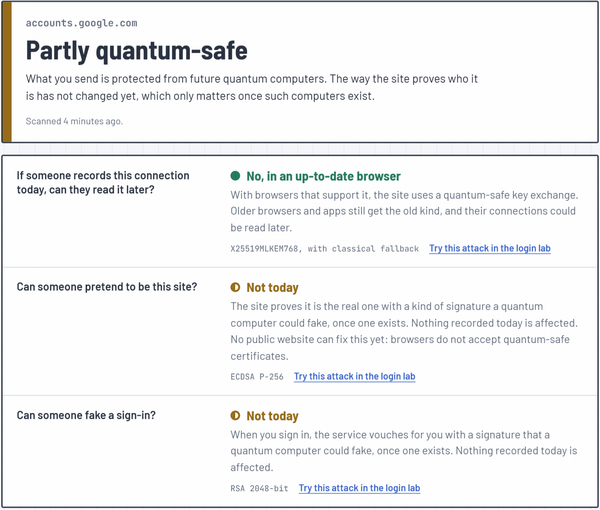
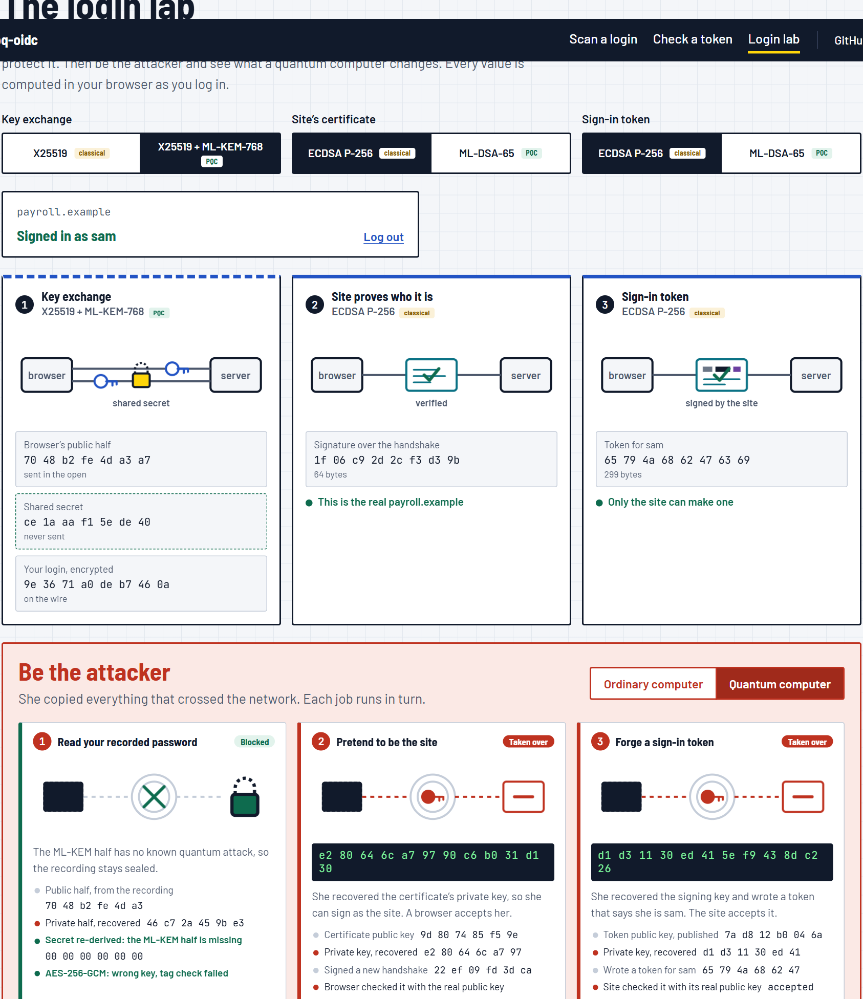
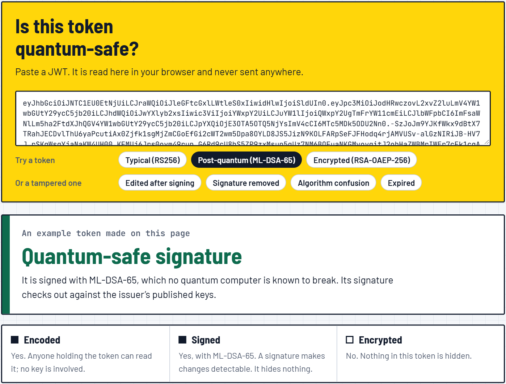

# pq-oidc: is this login quantum-safe?

[](https://github.com/probablyliam/pq-oidc/actions/workflows/ci.yml)
[](https://github.com/probablyliam/pq-oidc/actions/workflows/codeql.yml)
[](LICENSE)

Paste a site. The scanner finds its login, opens real TLS connections to it with its own TLS client, reads what the server sends and publishes, and answers three questions in plain words, with the evidence underneath for anyone who wants to check it.

<p align="center"></p>

| Question | What decides it | What a scan can see |
|---|---|---|
| If someone records this connection today, can they read it later? | the TLS key exchange | which groups the server negotiates and accepts, including hybrid ML-KEM |
| Can someone pretend to be this site? | the certificate's signature | the chain the server sends, and the signature it makes in the handshake |
| Can someone fake a sign-in? | the token signature | the keys an OpenID Connect provider publishes; for a login that publishes nothing, "cannot tell from outside" |

Every statement in the technical details is marked **observed** (read off the connection or a published document), **inferred** (a conclusion, with the reasoning) or **could not determine**. There is no score: the verdict is a stated function of those three layers ([ADR 0012](docs/adr/0012-finding-kinds-no-score.md)).

## Run it

The scanner opens its own connections, which a web page cannot do, so it runs as a small service on your machine. Needs [Node.js 25](https://nodejs.org); everything installs into the project folder.

```bash
git clone https://github.com/probablyliam/pq-oidc.git
cd pq-oidc
npm install
npm start          # http://localhost:8080
```

`npm start` runs the API, a worker, and seven local test servers with known configurations (classical, hybrid, post-quantum, TLS 1.2, RSA key transport, an expired certificate) so there is something to scan that is yours. Type a bare site such as `github.com`: the scanner follows the site's own "Sign in" link, or tries the usual addresses, and assesses where a password would go ([ADR 0015](docs/adr/0015-find-the-sign-in.md)).

The site at [probablyliam.github.io/pq-oidc](https://probablyliam.github.io/pq-oidc/) is the same web app without a scan service behind it: the token checker and the login lab work there, scanning does not.

**Docker:** `docker compose up --build`. **Kubernetes:** [`deploy/helm/pq-oidc`](deploy/helm/pq-oidc) runs the API and the worker as separate pods, with a NetworkPolicy that keeps the worker off private ranges and gives the API no egress at all. CI deploys it to a kind cluster and scans through it.

## The login lab

Set what a site uses for each of its three jobs (each option tagged classical or PQC), log in with a password you make up, and watch the three processes reveal with real values: the key exchange, the certificate signature, the signed token. Then be the attacker. Give her an ordinary computer and every attempt fails; give her a quantum computer and the parts that are still classical fall, one at a time, with her working shown (the public half she recorded, the private half she recovered, the secret she re-derived next to the real one, the decryption or signature check that settled it).

<p align="center"></p>

Every value is computed in the browser as you log in: X25519 and ML-KEM-768, the TLS 1.3 key schedule (the same functions the scanner uses to decrypt real handshakes), AES-256-GCM records, ECDSA P-256 and ML-DSA-65 signatures. Only the quantum computer is simulated, by handing her the private key it would compute; everything she then does with it is real, and either works or does not. The handshake is a simplified sketch of TLS 1.3, not an implementation of it.

## The token checker

Paste a JWT. It is read in your browser and never sent anywhere. The verdict says whether a quantum computer could forge tokens like it, the signature can be checked against the issuer's published keys, and the classic attacks (`alg: none`, algorithm confusion, edited claims, embedded keys) are recognised. Examples cover a typical token, a post-quantum one (ML-DSA-65), an encrypted one (RSA-OAEP), and the tampered kinds.

<p align="center"></p>

## What the scanner actually does

- **Its own TLS client** ([`packages/scan-core/src/tls`](packages/scan-core/src/tls)), because Node's TLS API does not report hybrid groups ([ADR 0006](docs/adr/0006-tls-handshake-observer.md)). It builds the ClientHello, parses ServerHello and HelloRetryRequest, runs the TLS 1.3 key schedule (checked against the RFC 8448 trace), decrypts the server's handshake flight, and verifies CertificateVerify and Finished. So "the server uses X25519MLKEM768" means the scanner and the server derived the same secret with it. Groups: X25519, P-256, P-384, X25519MLKEM768, SecP256r1MLKEM768, SecP384r1MLKEM1024, MLKEM768, MLKEM1024; TLS 1.2 ECDHE and RSA key transport are recognised too. Support for each group is established by HelloRetryRequest, one handshake per group.
- **Finds the login** from a bare site, and says how it did: the site's own link, a usual address, or where the site redirects.
- **Reads what the service publishes**: OpenID Connect metadata and the key set, so the sign-in question is answered from the identity provider's actual keys, not guessed. That is the one check a generic TLS scanner does not make, and the reason the tool leads with logins.
- **Also notices** problems that have nothing to do with quantum computers: expired or untrusted certificates, no HSTS, cookies without `Secure`, plain HTTP that does not redirect.

Verified on 2026-10-02 against local OpenSSL 3.5 servers in every group above, and with one scan each of accounts.google.com, login.microsoftonline.com, github.com, netflix.com, youtube.com and www.cloudflare.com.

### Safety

The scanner connects to addresses strangers type in, so the address boundary is the most carefully built part ([ADR 0007](docs/adr/0007-ssrf-defence.md), [`packages/scan-core/src/net`](packages/scan-core/src/net)): `https` only, ports 443 and 8443, no credentials in the URL, every name resolved once and every address checked against the private, loopback, link-local and metadata ranges (including IPv4-mapped, NAT64 and 6to4 forms of them) before the socket is pinned to that address; redirects, discovered links and `jwks_uri` all go through the same checks; size caps and deadlines on everything. The tests include the classic bypasses (decimal and octal IPs, `localhost` variants, DNS rebinding, redirects to the cloud metadata service).

There are no accounts ([ADR 0014](docs/adr/0014-no-accounts.md)): limits per visitor (a keyed hash of the address), per scanned service, and on the queue stand in for them; cross-site requests are refused; a result is kept for an hour behind a random ID, then deleted. The worker, the only part that connects out, holds no data; the API, which holds the results, connects nowhere ([ADR 0008](docs/adr/0008-api-worker-sqlite.md)). In Kubernetes a NetworkPolicy enforces that split in the network as well.

The full threat model, with each mitigation linked to the test that proves it: [docs/threat-model.md](docs/threat-model.md).

## The identity provider

The project started as an OpenID Connect provider that signs ID tokens with ML-DSA-65 and migrates apps to it one at a time. It is still here, and the scanner can scan it.

```bash
npm run oidc       # provider on :3000, a legacy app on :3001 (ES256), a migrated app on :3002 (ML-DSA-65)
npm run prove      # real sign-ins, keys read with plain fetch, tokens verified by an independent Python verifier
npm run interop    # Python and Node agree on RFC 9964, both directions
```

What it showed ([docs/findings.md](docs/findings.md)): the token grows 8.8× (a 3,309-byte signature, fixed by FIPS 204), no longer fits in a cookie, and on 2026-10-02 none of 20 public providers checked had published a post-quantum key. The migration order that avoids locking users out is demonstrated end to end, in the tests and in CI.

## Layout

```
packages/scan-core   the scanner: address policy, TLS observer, certificates, HTTP, OIDC discovery, assessment, plain-words summary
packages/token-kit   JOSE: analysis, verification, readiness, exact size projection (shared by the browser and the CLI)
services/api         scan jobs and results (SQLite), limits, the web app's static files; no outbound connections
services/worker      claims jobs, runs scans; the only component that connects to targets
apps/web             React: scan results, the token checker, the login lab
packages/provider    the ML-DSA-65 OpenID Connect provider; packages/rp its two demo apps
interop/python       an independent RFC 9964 verifier
deploy/helm          the chart; Dockerfile and docker-compose.yml at the root
docs/adr             fifteen decision records; docs/PLAN.md the plan and what is verified
```

No build step for the server code: Node.js runs the TypeScript sources directly.

## Development

```bash
npm test                 # 475 tests: address bypasses, the key schedule against RFC 8448, whole scans of the lab servers,
                         # the service's limits and leases, token attacks, the lab's cryptography
npm run lint && npm run typecheck
npm run dev              # the web app with hot reload, the API and worker beside it
npm run scan -- <url>    # a scan from the terminal, as JSON with --json
npm run check -- <url>   # the identity provider's keys alone, no TLS probing
```

## Standards

[FIPS 203: ML-KEM](https://csrc.nist.gov/pubs/fips/203/final) · [FIPS 204: ML-DSA](https://csrc.nist.gov/pubs/fips/204/final) · [RFC 8446: TLS 1.3](https://www.rfc-editor.org/rfc/rfc8446) · [draft-ietf-tls-ecdhe-mlkem](https://datatracker.ietf.org/doc/draft-ietf-tls-ecdhe-mlkem/) · [RFC 9964: ML-DSA for JOSE](https://www.rfc-editor.org/info/rfc9964/) · [OpenID Connect Discovery](https://openid.net/specs/openid-connect-discovery-1_0.html) · [OAuth 2.1 (draft)](https://datatracker.ietf.org/doc/draft-ietf-oauth-v2-1/)

## License

[MIT](LICENSE)
