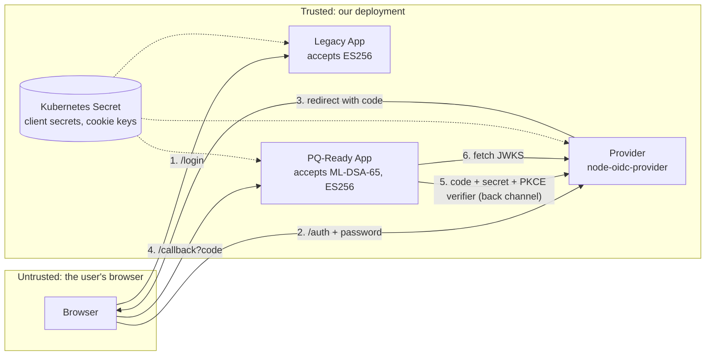

# Threat model

This document covers the pq-oidc provider, the two demo apps (relying parties), and the tokens that pass between them. It uses STRIDE. Every mitigation points to the code that implements it and, where possible, to the test that proves it.

## What we protect

| Asset | Why it matters |
|---|---|
| Provider signing keys (ES256, ML-DSA-65) | Anyone holding them can sign in as any user to every app. |
| ID tokens | Bearer proof of identity. A forged or stolen token is a stolen login. |
| Authorization codes | One-time credentials that turn into tokens at the token endpoint. |
| Client secrets | Let an app authenticate to the token endpoint. |
| User passwords | Entered only at the provider. |
| Session cookies (provider and apps) | Keep a user signed in. |

## System and trust boundaries

Trust boundaries are crossed at the browser (everything it sends is attacker-controllable), at the back channel between apps and provider (authenticated with client secrets), and at the JWKS fetch (the source of truth for public keys).

## Threats and mitigations

### Spoofing

| # | Threat | Mitigation | Evidence |
|---|---|---|---|
| S1 | **A quantum computer forges ID tokens.** Shor's algorithm recovers the ES256 private key from the published public key. | Apps migrate to ML-DSA-65 (FIPS 204), which has no known quantum attack. Once every app is migrated, the ES256 key is retired and removed from app allowlists. | `PQ_ID_TOKEN_ALG`, [ADR 0002](adr/0002-ml-dsa-65.md), [ADR 0003](adr/0003-per-client-algorithm.md) |
| S2 | Attacker sends an unsigned token (`alg: none`). | Verifier rejects `none` before anything else, and it is never on the allowlist. | `verify.ts`, test *rejects an unsigned token* |
| S3 | Algorithm confusion: attacker signs with HS256 using the public key as the HMAC secret. | Per-app algorithm allowlist; keys are matched by `kid` **and** `alg`. | test *rejects algorithm confusion* |
| S4 | Attacker embeds their own key in the token header (`jwk`, `jku`, `x5u`). | Keys come only from the provider's JWKS; header keys are ignored. | test *ignores an attacker key embedded in the token header* |
| S5 | Token issued to one app is replayed at another. | `aud` must equal this app's client ID. | test *rejects a token issued to a different app* |
| S6 | Attacker finishes a victim's login from their own browser (login CSRF). | oidc-provider binds each interaction to an `_interaction` cookie; the uid alone is not enough. | test *cannot finish a login from a different browser session* |
| S7 | Password guessing at the login form. | Constant-time credential comparison. **Not mitigated:** rate limiting and lockout (demo scope, see residual risks). | `accounts.ts` |

### Tampering

| # | Threat | Mitigation | Evidence |
|---|---|---|---|
| T1 | Claims edited after signing. | Signature covers header and payload. | test *rejects a token whose payload was edited* |
| T2 | Authorization response tampered (state swapped). | `state` checked by openid-client; `nonce` checked in the ID token. | `app.ts` (`expectedState`, `expectedNonce`), test *nonce mismatch* |
| T3 | Signing algorithm changed by the request. | The algorithm is fixed by the client's server-side registration (`id_token_signed_response_alg`), not by any request parameter. | `clients.ts` |

### Repudiation

| # | Threat | Mitigation |
|---|---|---|
| R1 | A user denies signing in. | ID tokens are signed and carry `iat` and `auth_time`. **Partial:** there is no durable audit log in the demo. |

### Information disclosure

| # | Threat | Mitigation | Evidence |
|---|---|---|---|
| I1 | Private key material leaks through the JWKS endpoint. | oidc-provider publishes public parts only. A test checks no `d` (EC) or `priv` (ML-DSA seed) appears. | test *publishes ... with no private material* |
| I2 | Authorization code stolen (logs, referrer, malicious app). | PKCE with S256 is mandatory; `plain` is refused; codes are single-use and live 60 seconds; codes are bound to the client. | tests *rejects requests without PKCE*, *plain*, *only once*, *stolen code*, *another app's code* |
| I3 | Tokens delivered to an attacker's redirect URI. | Exact redirect URI matching; unknown URIs get an error page, not a redirect. | test *never redirects to an unregistered redirect_uri* |
| I4 | Tokens leak through the URL (implicit flow). | Only `response_type=code` is supported (OAuth 2.1). | test *rejects the implicit flow* |
| I5 | XSS on the login page steals the password. | All output HTML-escaped; strict CSP with no inline scripts. | tests *escapes user input*, *forbids framing and inline scripts* |
| I6 | Clickjacking the login form. | `frame-ancestors 'none'`. | same test |
| I7 | Page scripts read session cookies. | App cookies are `HttpOnly`, `SameSite=Lax`, and `Secure` when served over HTTPS. | `cookies.ts` |

### Denial of service

| # | Threat | Mitigation | Evidence |
|---|---|---|---|
| D1 | **Post-quantum tokens break size limits.** A 4.9 KB ML-DSA-65 token exceeds the 4,096-byte cookie limit, and adds pressure on proxy header limits. Users get silently logged out. | Apps keep tokens server-side and put only a short session ID in the cookie. The migration simulator treats "token in cookie" as a blocker. | e2e test *browser drops the oversized cookie*, [findings](findings.md) |
| D2 | Large form bodies on the login endpoint. | Form bodies capped at 8 KB. | `interactions.ts` |
| D3 | Premature migration locks users out of an app. | Per-client rollout, with ES256 kept as the rollback path until the app is verified. | e2e *switching an app before it is ready*, CI step *Migrate Legacy App too early* |

### Elevation of privilege

| # | Threat | Mitigation |
|---|---|---|
| E1 | Container compromise leads to host access. | Non-root user, read-only root filesystem, all Linux capabilities dropped, `seccompProfile: RuntimeDefault`, no service-account token mounted. |
| E2 | A compromised app obtains other apps' tokens. | Each client has its own secret and audience; codes can't be redeemed by another client. |

## Residual risks and deliberate non-goals

These are accepted for a demo and would need work before production:

- **In-memory state.** Sessions, codes and keys live in memory, so the provider runs as one replica and loses state on restart. Production needs a storage adapter (Redis or a database) and keys loaded from a KMS or secret store (`SIGNING_KEYS_JSON` is the hook).
- **No rate limiting or account lockout** on the login form.
- **Demo users with a published password.** Real deployments delegate to a user directory with MFA.
- **HTTP on localhost.** Real deployments terminate TLS in front of the provider (`TRUST_PROXY=true`).
- **Classical TLS in transit** is out of scope here; hybrid ML-KEM key exchange is handled by the TLS layer (Node.js 24 and most browsers already negotiate X25519MLKEM768).
- **Only the ID token signature is post-quantum.** Client secrets, cookies and the (opaque) access tokens do not depend on public-key signatures.
