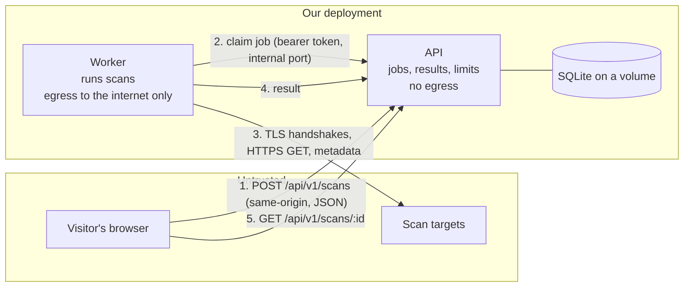
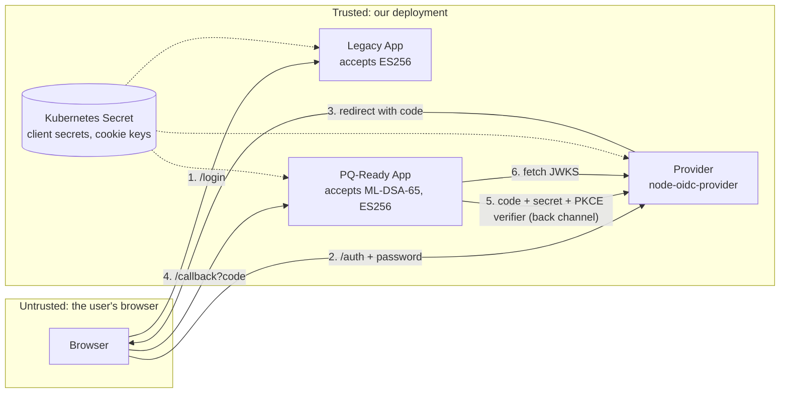

# Threat model

Two systems, in two parts. **Part 1** is the scanner: a service that opens connections to addresses strangers type in. **Part 2** is the identity provider the project started as, with its two demo apps. Both use STRIDE, and every mitigation points to the code that implements it and, where possible, to the test that proves it.

# Part 1: the scanner

## What we protect

| Asset | Why it matters |
|---|---|
| Everything on the network the scanner can reach | The scanner connects where it is told. The threat is being pointed at something other than a public website: a cloud metadata service, a database, another pod. |
| Third parties' servers | A free scanner can be used to hammer a site that never asked for it. |
| The worker's token | Whoever holds it can claim jobs and post results for them. |
| Scan results | They contain only what the scanned server shows to everyone, but a result should not be listable or linked to a person. |

## System and trust boundaries

Trust is crossed at the visitor (every address is attacker-controlled), at every byte the target sends (TLS records, HTML, redirects, metadata, key sets: all parsed by the worker), and at the worker's internal port (authenticated with the token, reachable only from the worker's network in Kubernetes).

## Threats and mitigations

### Spoofing and elevation of privilege: being pointed at the wrong thing

| # | Threat | Mitigation | Evidence |
|---|---|---|---|
| X1 | **SSRF.** A visitor types an internal address, or one of its many spellings: `127.1`, decimal or octal IPs, `localhost` variants, an IPv4-mapped IPv6 address, NAT64 or 6to4 forms, a public name that resolves to a private address, or one that resolves differently the second time. | `https` only, ports 443 and 8443, no credentials. Every name is resolved once, every returned address is classified against the private, loopback, link-local, multicast and cloud-metadata ranges (with embedded IPv4 extracted from IPv6 forms), and the socket is pinned to the checked address with a lookup guard, so DNS is never consulted again ([ADR 0007](adr/0007-ssrf-defence.md), `packages/scan-core/src/net`). | `address.test.ts`, `policy.test.ts`, `resolve.test.ts` (every range, every spelling, a rebinding resolver) |
| X2 | A target redirects the scanner to an internal address, another port, plain http, or a `file:` URL. | Redirects are followed by hand; each location is a new target through the same checks. A refused one is reported, never fetched. | `scan.test.ts` *a hostile target cannot steer the scanner* (nine cases) |
| X3 | Metadata names a `jwks_uri` on an internal address. | The key set URL goes through the same policy and pinning. | `scan.test.ts` *a jwks_uri pointing at an internal address is never fetched* |
| X4 | A page links its "Sign in" to an internal or plain-http address. | Links found on a page are candidates only; each is parsed through the policy, and only https links are collected. | `scan.test.ts` *refuses links the policy forbids* |
| X5 | A bug in the application's address checks. | In Kubernetes, a NetworkPolicy on the worker denies egress to private ranges and to every pod except the API's internal port; the API has no egress at all ([`deploy/helm`](../deploy/helm/pq-oidc/templates/scanner.yaml)). Needs a CNI that enforces policies; CI checks the manifests render as intended. | CI step *the rendered chart keeps the worker off private ranges* |
| X6 | Someone other than the worker claims jobs or posts results. | The internal port needs the worker token, compared in constant time; it is a separate listener on a separate port, not published by Compose and not reachable through the API's Service from outside. | `service.test.ts` *worker protocol* |

### Tampering

| # | Threat | Mitigation | Evidence |
|---|---|---|---|
| X7 | A target sends malformed TLS, oversized records, a never-ending body, or a redirect loop. | Length-checked parsing of every TLS message; size caps on bodies (256 kB for pages, 512 kB for key sets); timeouts per connection and a deadline for the whole scan; a redirect cap. | `observe.test.ts`, `scan.test.ts` *size cap*, *slow*, *loop* |
| X8 | A compromised worker reports false results. | Accepted: a worker can only lie about jobs it holds. It holds no data and no other credential. | ADR 0008 |

### Information disclosure

| # | Threat | Mitigation | Evidence |
|---|---|---|---|
| X9 | Results are listed, or linked to a person. | A result is read by its random UUID only; nothing lists them; they are deleted after an hour. The visitor is stored as an HMAC of the address under a key made at start-up and never written down. No address or token appears in the logs. | `service.test.ts` *the database keeps only a hashed client*, *logs carry no token or address*, *deletes results after an hour* |
| X10 | A pasted token reaches the server. | The token checker runs in the browser; only an issuer's address is ever sent, and only when the visitor asks ([ADR 0010](adr/0010-token-analysis-in-browser.md)). | |
| X11 | A cookie value from a scanned site is kept in a result. | Only cookie names and flags are summarised. | `scan.test.ts` *reads HSTS and cookie flags* |

### Denial of service

| # | Threat | Mitigation | Evidence |
|---|---|---|---|
| X12 | One visitor floods the scanner, or many visitors are pointed at one site. | Per visitor: 20 scans per 10 minutes, 3 in progress. Per scanned service (name and port): 3 per minute, whoever asks. A repeat within 5 minutes is answered with the earlier result. A queue ceiling. Cross-site requests are refused, so a page elsewhere cannot spend a visitor's allowance. | `service.test.ts` *limits* (five tests), *cross-site* |
| X13 | A worker dies mid-scan. | Jobs are leased; an expired lease is retried once, then marked lost. | `service.test.ts` *leases* |

## Residual risks

- **On Vercel** (the live site, ADR 0016) there is no worker split and no NetworkPolicy: the function that parses a target's bytes is the one that answers the visitor. It holds nothing but the request in hand. The limits live in the memory of a function instance, so they are best-effort across instances and restarts; what protects third parties and the host is the address policy and the per-connection bounds, which do not depend on memory.
- The per-visitor limit is only as good as the client address. Behind a proxy, set `TRUST_PROXY=true`; visitors behind one NAT share an allowance.
- A result link is a bearer secret for an hour. It contains only what the scanned server shows to everyone.
- The NetworkPolicy is a manifest; it protects nothing on a cluster whose CNI does not enforce policies (kind's default does not).
- The scanner speaks TLS over TCP only: HTTP/3 is not observed. Behaviour through an HTTP proxy is untested; IPv6 targets are tested with literals, not a live server.

# Part 2: the identity provider

This part covers the pq-oidc provider, the two demo apps (relying parties), and the tokens that pass between them.

## What we protect

| Asset | Why it matters |
|---|---|
| Provider signing keys (ES256, ML-DSA-65) | Anyone holding them can sign in as any user to every app. |
| ID tokens | Bearer proof of identity. A forged or stolen token is a stolen login. |
| Authorization codes | One-time credentials that turn into tokens at the token endpoint. |
| Client secrets | Let an app authenticate to the token endpoint. |
| User passwords | Entered only at the provider. |
| Session cookies (provider and apps) | Keep a user signed in. |

## System and trust boundaries

Trust boundaries are crossed at the browser (everything it sends is attacker-controllable), at the back channel between apps and provider (authenticated with client secrets), and at the JWKS fetch (the source of truth for public keys).

## Threats and mitigations

### Spoofing

| # | Threat | Mitigation | Evidence |
|---|---|---|---|
| S1 | **A quantum computer forges ID tokens.** Shor's algorithm recovers the ES256 private key from the published public key. | Apps migrate to ML-DSA-65 (FIPS 204), which has no known quantum attack. Once every app is migrated, the ES256 key is retired and removed from app allowlists. | `PQ_ID_TOKEN_ALG`, [ADR 0002](adr/0002-ml-dsa-65.md), [ADR 0003](adr/0003-per-client-algorithm.md) |
| S2 | Attacker sends an unsigned token (`alg: none`). | Verifier rejects `none` before anything else, and it is never on the allowlist. | `verify.ts`, test *rejects an unsigned token* |
| S3 | Algorithm confusion: attacker signs with HS256 using the public key as the HMAC secret. | Per-app algorithm allowlist; keys are matched by `kid` **and** `alg`. | test *rejects algorithm confusion* |
| S4 | Attacker embeds their own key in the token header (`jwk`, `jku`, `x5u`). | Keys come only from the provider's JWKS; header keys are ignored. | test *ignores an attacker key embedded in the token header* |
| S5 | Token issued to one app is replayed at another. | `aud` must equal this app's client ID. | test *rejects a token issued to a different app* |
| S6 | Attacker finishes a victim's login from their own browser (login CSRF). | oidc-provider binds each interaction to an `_interaction` cookie; the uid alone is not enough. | test *cannot finish a login from a different browser session* |
| S7 | Password guessing at the login form. | Constant-time credential comparison. **Not mitigated:** rate limiting and lockout (demo scope, see residual risks). | `accounts.ts` |

### Tampering

| # | Threat | Mitigation | Evidence |
|---|---|---|---|
| T1 | Claims edited after signing. | Signature covers header and payload. | test *rejects a token whose payload was edited* |
| T2 | Authorization response tampered (state swapped). | `state` checked by openid-client; `nonce` checked in the ID token. | `app.ts` (`expectedState`, `expectedNonce`), test *nonce mismatch* |
| T3 | Signing algorithm changed by the request. | The algorithm is fixed by the client's server-side registration (`id_token_signed_response_alg`), not by any request parameter. | `clients.ts` |

### Repudiation

| # | Threat | Mitigation |
|---|---|---|
| R1 | A user denies signing in. | ID tokens are signed and carry `iat` and `auth_time`. **Partial:** there is no durable audit log in the demo. |

### Information disclosure

| # | Threat | Mitigation | Evidence |
|---|---|---|---|
| I1 | Private key material leaks through the JWKS endpoint. | oidc-provider publishes public parts only. A test checks no `d` (EC) or `priv` (ML-DSA seed) appears. | test *publishes ... with no private material* |
| I2 | Authorization code stolen (logs, referrer, malicious app). | PKCE with S256 is mandatory; `plain` is refused; codes are single-use and live 60 seconds; codes are bound to the client. | tests *rejects requests without PKCE*, *plain*, *only once*, *stolen code*, *another app's code* |
| I3 | Tokens delivered to an attacker's redirect URI. | Exact redirect URI matching; unknown URIs get an error page, not a redirect. | test *never redirects to an unregistered redirect_uri* |
| I4 | Tokens leak through the URL (implicit flow). | Only `response_type=code` is supported (OAuth 2.1). | test *rejects the implicit flow* |
| I5 | XSS on the login page steals the password. | All output HTML-escaped; strict CSP with no inline scripts. | tests *escapes user input*, *forbids framing and inline scripts* |
| I6 | Clickjacking the login form. | `frame-ancestors 'none'`. | same test |
| I7 | Page scripts read session cookies. | App cookies are `HttpOnly`, `SameSite=Lax`, and `Secure` when served over HTTPS. | `cookies.ts` |

### Denial of service

| # | Threat | Mitigation | Evidence |
|---|---|---|---|
| D1 | **Post-quantum tokens break size limits.** A 4.9 KB ML-DSA-65 token exceeds the 4,096-byte cookie limit, and adds pressure on proxy header limits. Users get silently logged out. | Apps keep tokens server-side and put only a short session ID in the cookie. The migration simulator treats "token in cookie" as a blocker. | e2e test *browser drops the oversized cookie*, [findings](findings.md) |
| D2 | Large form bodies on the login endpoint. | Form bodies capped at 8 KB. | `interactions.ts` |
| D3 | Premature migration locks users out of an app. | Per-client rollout, with ES256 kept as the rollback path until the app is verified. | e2e *switching an app before it is ready*, CI step *Migrate Legacy App too early* |

### Elevation of privilege

| # | Threat | Mitigation |
|---|---|---|
| E1 | Container compromise leads to host access. | Non-root user, read-only root filesystem, all Linux capabilities dropped, `seccompProfile: RuntimeDefault`, no service-account token mounted. |
| E2 | A compromised app obtains other apps' tokens. | Each client has its own secret and audience; codes can't be redeemed by another client. |

## Residual risks and deliberate non-goals

These are accepted for a demo and would need work before production:

- **In-memory state.** Sessions, codes and keys live in memory, so the provider runs as one replica and loses state on restart. Production needs a storage adapter (Redis or a database) and keys loaded from a KMS or secret store (`SIGNING_KEYS_JSON` is the hook).
- **No rate limiting or account lockout** on the login form.
- **Demo users with a published password.** Real deployments delegate to a user directory with MFA.
- **HTTP on localhost.** Real deployments terminate TLS in front of the provider (`TRUST_PROXY=true`).
- **Classical TLS in transit** is out of scope here; hybrid ML-KEM key exchange is handled by the TLS layer (Node.js 24 and most browsers already negotiate X25519MLKEM768).
- **Only the ID token signature is post-quantum.** Client secrets, cookies and the (opaque) access tokens do not depend on public-key signatures.
